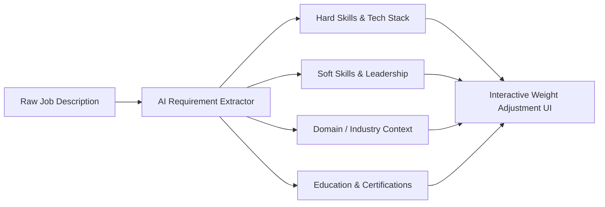
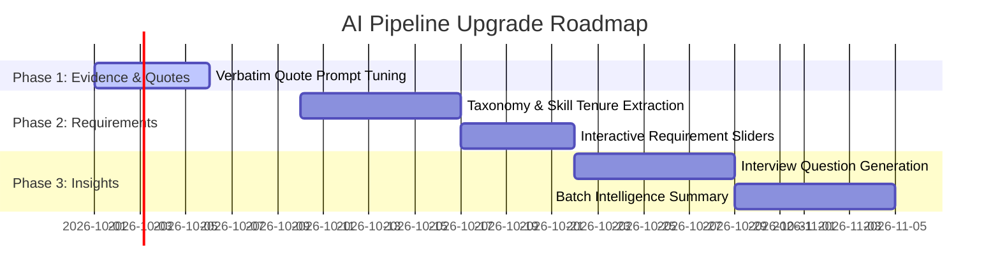

# AI Extraction, Evidence Quality & Candidate Suggestions Enhancement Proposal

## Executive Summary

This proposal outlines actionable strategies to upgrade **CV-Rank's** AI evaluation pipeline. By improving requirement extraction precision, grounding evidence in verbatim quotes with section provenance, and introducing AI-driven interview question suggestions and risk alerts, CV-Rank will deliver significantly higher trust and utility to hiring managers.

---

## 1. 🔍 Evidence Extraction Improvements

### Current Limitations
- Evidence snippets are sometimes summarized or paraphrased by the LLM without section context.
- Hiring managers cannot easily verify which part of the resume produced a specific match score.

### Proposed Upgrades

| Feature | Description | Implementation Strategy |
| :--- | :--- | :--- |
| **Verbatim Quote Citation** | Force the LLM to output exact text snippets from the resume rather than paraphrases. | Update `assess_candidate` prompt: `"evidence must contain verbatim text snippets copied directly from cv_text without editing."` |
| **Section & Position Provenance** | Tag each quote with its source section (e.g., *Experience: Acme Corp (2022-2024)*). | Format evidence strings as: `"[Work Experience] Worked 3 years developing Python APIs"`. |
| **Justification & Gap Reasoning** | Add a `reasoning` field to explain classification choices (e.g. why `partial_match` vs `strong_match`). | Add `reasoning: str` to `RequirementMatch` schema (e.g. *"Candidate has 2 years of Python, but job requested 4+ years"*). |
| **Visual Resume Highlight Links** | Match evidence snippets against the raw PDF text to visually highlight evidence inline. | Return character offsets `(start_char, end_char)` for UI text highlighting. |

---

## 2. 🎯 AI Requirement Extraction & Job Analysis

### Current Limitations
- Requirements are extracted into simple lists (`skills`, `experience`, `education`) with default weights.

### Proposed Upgrades

1. **Structured Requirement Taxonomy**:
   - **Hard Skills & Tools**: (e.g., Python, PostgreSQL, PyTorch)
   - **Domain & Industry Experience**: (e.g., FinTech, E-commerce, High-Volume Data)
   - **Soft Skills & Management**: (e.g., Team Leadership, Client Management)
   - **Education & Certifications**: (e.g., AWS Certified Solutions Architect, B.Sc. CS)

2. **Per-Requirement Experience Thresholds**:
   - Extract required tenure per skill (e.g. `Python: 3+ years`, `Docker: 1+ years`) instead of a global minimum experience number.

3. **Interactive Manager Weight Sliders**:
   - Allow hiring managers to review extracted requirements before candidate evaluation and set importance levels (`Critical / Mandatory`, `Important`, `Nice-to-Have`).

---

## 3. 💡 Actionable AI Suggestions & Candidate Insights

### Proposed New Features

#### A. Tailored Interview Probing Questions
Automatically generate 2-3 specific interview questions targeting identified skill gaps or unverified claims.
> **Example**:  
> *"Candidate mentions Docker in skills, but no containerized deployment projects are detailed. Ask: 'Can you describe a production container deployment workflow you built from scratch?'"*

#### B. Executive Candidate Summary & USP
Generate a 2-sentence summary highlighting the candidate's **Unique Selling Proposition (USP)** for the specific job.
> **Example**:  
> *"Alex is a strong backend developer with 4 years of Python & FastAPI experience. While missing Kubernetes cluster management, their deep PostgreSQL optimization background makes them a top contender for the backend role."*

#### C. Risk & Discrepancy Spotter
Flag potential red flags or areas needing clarification during interview rounds:
- Unexplained employment gaps > 1 year
- Skill listed in header but absent in work experience bullets
- Overqualified / underqualified mismatches

#### D. Batch Comparison & Portfolio Insights
When evaluating a batch of 5+ candidates, generate a **Batch Intelligence Summary**:
- **Common Strengths**: e.g., 80% of candidates meet the Python requirement.
- **Rare Differentiators**: e.g., Only Candidate #2 has production AWS experience.
- **Recommended Top 3 Shortlist**: Instant AI recommendation for interview selection.

---

## 4. 🚀 Implementation Roadmap

